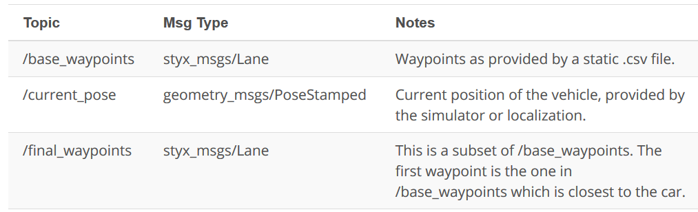

# 1. Introduction
The goal of this project is to enable Karla (the Udacity’ car) to drive around the test track using waypoint navigation.  I'll be implementing components of the perception,planning, and control subsystems.

* In the perception subsystem, I'll implement traffic light detection and obstacle detection.

* In the planning subsystem, I'll implement a node called the waypoint updater. This node sets the target velocity for each waypoint based on the upcoming traffic lights and obstacles. For example, if the car sees a red traffic light on the horizon will to set decelerating velocities at the nodes leading up to that traffic light.

* In the control subsystem, I'll implement a drive by wire ROS node that takes target trajectory information is input, in sense, control commands to navigate the vehicle.

The project will require the use of Ubuntu Linux (the operating system of Carla) and a ROS framework for these nodes, as well as a version of the simulator that includes traffic lights and obstacles. 

### follow the steps below to get set up:

1. Because ROS is used, you will need to use Ubuntu to develop and test this project code. You may use

          Ubuntu 14.04 with ROS Indigo 
          Ubuntu 16.04 with ROS Kinetic
     
    Note: Please use the VM provided in **the [Introduction to ROS](https://github.com/A2Amir/Introduction-to-ROS--Robot-Operating-System) lesson**. The provided VM has ROS and Dataspeed DBW installed already.

2. The project repo can be found [here](https://github.com/udacity/CarND-Capstone). In the README, you should be able find any additional dependencies needed for the project.
3. Within the the VM provided in **the [Introduction to ROS](https://github.com/A2Amir/Introduction-to-ROS--Robot-Operating-System) lesson** you can download the linux  version of the simulator [here](https://github.com/udacity/CarND-Capstone/releases) and install it. 
    
    Note that the latest version of the simulator has two test tracks: 
    
          A highway test track with traffic lights
          A testing lot test track similar to where the Udacity team will run Carla
    
    To use the second test lot, you will need to update your code to specify a new set of waypoints. I'll discuss how to do this in a later lesson. Additionally, the first track has a toggle button for camera data. Finally, the simulator displays vehicle velocity in units of mph. However, all values used within the project code use the metric system (m or m/s), including current velocity data coming from the simulator.
4. Clone this project repository

          mkdir CarND-Capstone
          cd CarND-Capstone/
          git clone https://github.com/A2Amir/Program-an-Autonomous-Vehicle.git

5. Install python dependencies

          pip install -r requirements.txt
          
6. Make and run styx

          cd ros
          catkin_make
          source devel/setup.sh
          roslaunch launch/styx.launch

7. Run the simulator

# 2. Project Overview

For this project, I will be writing ROS nodes to implement core functionality of the autonomous vehicle system, including traffic light detection, control, and waypoint following and I will test my code using the simulator.

### System Architecture Diagram

The following is a system architecture diagram showing the ROS nodes and topics used in the project. (I refer to the diagram throughout the project). The ROS nodes and topics shown in the diagram are described briefly in the **Code Structure** section below and more detail is provided for each node later.

          
          
### Code Structure
Below is a brief overview of the repo structure, along with descriptions of the ROS nodes. Within this directory /ros/src/, you will find the following ROS packages:

#### 1. /ros/src/tl_detector/

This package contains the traffic light detection node: **tl_detector.py**. This node takes in data from the **/image_color, /current_pose, and /base_waypoints topics** and publishes the locations to stop for red traffic lights to the **/traffic_waypoint topic**.
The **/current_pose** topic provides the vehicle's current position, and **/base_waypoints** provides a complete list of waypoints the car will be following.

l build both a traffic light detection node and a traffic light classification node. Traffic light detection takes place within **tl_detector.py**, whereas traffic light classification takes place within **../tl_detector/light_classification_model/tl_classfier.py**

          
          
          
#### 2. /ros/src/waypoint_updater/
This package contains the waypoint updater node: **waypoint_updater.py**. The purpose of this node is to update the target velocity property of each waypoint based on traffic light and obstacle detection data. This node will subscribe to **the /base_waypoints, /current_pose, /obstacle_waypoint, and /traffic_waypoint topics**, and publish a list of waypoints ahead of the car with target velocities to **the /final_waypoints** topic.

          
Note: Waypoints are simply an ordered set of coordinates that Karla uses to plan a path around the track. Each of these waypoints also has an associated target velocity. Karla's planning subsystem updates the target velocity for the waypoints ahead of the vehicle depending on the desired vehicle behavior.

#### 3. /ros/src/twist_controller/

Carla is equipped with a drive-by-wire (dbw) system, meaning the throttle, brake and steering have electronic control. This package contains the files that are responsible for control of the vehicle: the node dbw_node.py and the file twist_controller.py, along with a pid and lowpass filter that I can use in my implementation. 

The dbw_node subscribes to the **/current_velocity topic** along with the **/twist_cmd topic** to receive target linear and angular velocities. Additionally, this node will subscribe to **/vehicle/dbw_enabled**, which indicates if the car is under dbw or driver control. This node will publish throttle, brake, and steering commands to the **/vehicle/throttle_cmd, /vehicle/brake_cmd and /vehicle/steering_cmd topics**.

#### In addition to these packages will find in this directory the following:

* /ros/src/styx/: A package that contains a server for communicating with the simulator, and a bridge to translate and publish simulator messages to ROS topics.

* /ros/src/styx_msgs/:A package which includes definitions of the custom ROS message types used in the project.

* /ros/src/waypoint_loader/:A package which loads the static waypoint data and publishes to /base_waypoints.

* /ros/src/waypoint_follower/:A package containing code from [Autoware](https://github.com/CPFL/Autoware) which subscribes to /final_waypoints and publishes target vehicle linear and angular velocities in the form of twist commands to the /twist_cmd topic. 

# 3. Suggested Order of Project Development
Because I will be writing code across several packages with some nodes depending on messages published by other nodes, I completed the project in the following order:
<b>
1. Waypoint Updater Node (Partial): I Completed a partial waypoint updater which subscribes to /base_waypoints and /current_pose and publishes to /final_waypoints.       
2. DBW Node: Once my waypoint updater is publishing /final_waypoints, the waypoint_follower node will start publishing messages to the/twist_cmd topic. At this point,I have everything needed to build the dbw_node. After completing this step, the car should drive in the simulator, ignoring the traffic lights.
3. Traffic Light Detection: This can be split into 2 parts:
    * Detection: Detect the traffic light and its color from the /image_color. The topic /vehicle/traffic_lights contains the exact location and status of all traffic lights in simulator, so I can test my output.
    * Waypoint publishing: Once I have correctly identified the traffic light and determined its position, you can convert it to a waypoint index and publish it.        
4. Waypoint Updater (Full): Use /traffic_waypoint to change the waypoint target velocities before publishing to /final_waypoints. My car should now stop at red traffic lights and move when they are green.
</b>
In the next section, I'll cover each component of the project.

## 3.1 Waypoint Updater Node (Partial)

The goal for the first version of the node should be simply to subscribe to the topics 

          /base_waypoints 
          /current_pose
          
and publish a list of waypoints to 

          /final_waypoints
          
The /base_waypoints topic publishes a list of all waypoints for the track, so this list includes waypoints both before and after the vehicle (note that the publisher for /base_waypoints publishes only once). For this step in the project, the list published to /final_waypoints should include just a fixed number of waypoints currently ahead of the vehicle:

* The first waypoint in the list published to /final_waypoints should be the first waypoint that is currently ahead of the car. 
* The total number of waypoints ahead of the vehicle that should be included in the /final_waypoints list is provided by the LOOKAHEAD_WPS variable in waypoint_updater.py.
          
The next section includes details about the message type used to publish to /final_waypoints.

### Waypoint Message Descriptions

From the code in [PartialWaypointUpdaterNode.py](https://github.com/A2Amir/Program-an-Autonomous-Vehicle/blob/master/Code/PartialWaypointUpdaterNode.py), I can see that both the /final_waypoints and /base_waypoints topics have message type Lane. I can look at the details about this message type in /ros/src/styx_msgs/msg/, but this can also be done from the command line after launching the ROS project using rostopic and rosmsg as follows:

After opening a new terminal window and sourcing devel/setup.bash, I can investigate topics (see [this lesson]( https://github.com/A2Amir/Introduction-to-ROS--Robot-Operating-System) for more information) by executing:

	rostopic list
	rostopic info /final_waypoints
	rosmsg info styx_msgs/Lane

the result is:

          std_msgs/Header header
            uint32 seq
            time stamp
            string frame_id
          styx_msgs/Waypoint[] waypoints
            geometry_msgs/PoseStamped pose
              std_msgs/Header header
                uint32 seq
                time stamp
                string frame_id
              geometry_msgs/Pose pose
                geometry_msgs/Point position
                  float64 x
                  float64 y
                  float64 z
                geometry_msgs/Quaternion orientation
                  float64 x
                  float64 y
                  float64 z
                  float64 w
            geometry_msgs/TwistStamped twist
              std_msgs/Header header
                uint32 seq
                time stamp
                string frame_id
              geometry_msgs/Twist twist
                geometry_msgs/Vector3 linear
                  float64 x
                  float64 y
                  float64 z
                geometry_msgs/Vector3 angular
                  float64 x
                  float64 y
                  float64 z
   
 
 As seen above the messages contain a header and a Waypoint list named waypoints. Each waypoint has pose and twist data. Going further, I can see that twist.twist data contains 3D linear and angular velocities. For more information about twist messages, see [documentation here](http://docs.ros.org/jade/api/geometry_msgs/html/msg/Twist.html).
 
### Topics and message types

For convenience, I have provided the following table with topic and message info for this step of the project:

  

After implementing and executing the [code](https://github.com/A2Amir/Program-an-Autonomous-Vehicle/blob/master/Code/PartialWaypointUpdaterNode.py) for the first step of the suggested Order of Project Development I saw the following result:

  

## 3.2 DBW Node

Once messages are being published to /final_waypoints, the vehicle's waypoint follower will publish twist commands to the /twist_cmd topic. The goal for this part of the project is to implement the drive-by-wire node ([dbw_node.py](https://github.com/A2Amir/Program-an-Autonomous-Vehicle/blob/master/Code/dbw_node.py)) which will subscribe to /twist_cmd and use various controllers to provide appropriate throttle, brake, and steering commands. These commands can then be published to the following topics:

	•/vehicle/throttle_cmd
	•/vehicle/brake_cmd
	•/vehicle/steering_cmd

Since a safety driver may take control of the car during testing, I should not assume that the car is always following my commands. If a safety driver does take over, my PID controller will mistakenly accumulate error, I will need to be mindful of DBW status. The DBW status can be found by subscribing to /vehicle/dbw_enabled. 

All code necessary to implement the drive-by-wire node can be found in the package:
	
	../ros/src/twist_controller

### Twist controller package files: 

**within the twist controller package, can be found the following:**

* [dbw_node.py](https://github.com/A2Amir/Program-an-Autonomous-Vehicle/blob/master/Code/dbw_node.py): This python file implements the dbw_node publishers and subscribers. I will need to write ROS subscribers for the /current_velocity, /twist_cmd, and /vehicle/dbw_enabled topics. This file also imports the Controller class from [twist_controller.py](https://github.com/A2Amir/Program-an-Autonomous-Vehicle/blob/master/Code/twist_controller.py) which will be used for implementing the necessary controllers. The function used to publish throttle, brake, and steering is publish.
	
	Note that throttle values passed to publish should be in the range 0 to 1, although a throttle of 1 means the vehicle throttle will be fully engaged. Brake values passed to publish should be in units of torque (N*m). The correct values for brake can be computed using the desired acceleration, weight of the vehicle, and wheel radius.

*  [twist_controller.py](https://github.com/A2Amir/Program-an-Autonomous-Vehicle/blob/master/Code/twist_controller.py): This file contains a stub of the Controller class. I can use this class to implement vehicle control. For example, the control method can take twist data as input and return throttle, brake, and steering values. Within this class, I can import and use the provided pid.py and lowpass.py if needed for acceleration, and yaw_controller.py for steering.

* yaw_controller.py: A controller that can be used to convert target linear and angular velocity to steering commands.

* pid.py: A generic PID controller that can be used in twist_controller.py.

* lowpass.py: A generic low pass filter that can be used in twist_controller.py

Note: 

* dbw_node.py is currently set up to publish steering, throttle, and brake commands at 50hz. The DBW system on Carla expects messages at this frequency, and will disengage (reverting control back to the driver) if control messages are published at less than 10hz (This is a safety feature).

* Self-driving Car in the simulator has an automatic transmission, which means the car will roll forward if no brake and no throttle is applied. To prevent the car from moving requires about 700 Nm of torque.

* The CarND-Capstone/ros/src/waypoint_loader/launch/waypoint_loader.launch file is set up to load the waypoints for the first track. To test using the second track, you will need to change <param name="path" value="$(find styx)../../../data/wp_yaw_const.csv" />
to use the churchlot_with_cars.csv as follows: <param name="path" value="$(find styx)../../../data/churchlot_with_cars.csv"/>

Check these file ([dbw_node.py](https://github.com/A2Amir/Program-an-Autonomous-Vehicle/blob/master/Code/dbw_node.py), [twist_controller.py](https://github.com/A2Amir/Program-an-Autonomous-Vehicle/blob/master/Code/twist_controller.py) ) to get more familiar with the DBW Node and twist Controller.

## 3.3 Traffic Light Detection
#### Detection:
For the first phase of  the Traffic light Detection please check this Repository.

#### Waypoint publishing:
As said before once I have correctly identified the traffic light and determined its position, I can convert it to a waypoint index and publish it. check this [code]() to get more familiar with this phase.

